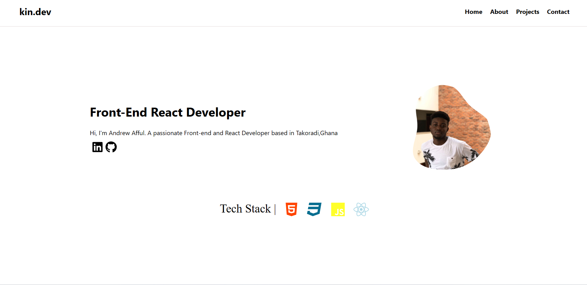

# My Portfolio Website

Welcome to my portfolio website project! This web application showcases my skills, projects, and experiences. The project is currently live and can be accessed at [Your Portfolio URL](https://andrew-afful.vercel.app/).

## Preview

## About Me

I am a [Your Profession] with a passion for [Your Interests or Specializations]. This portfolio website is designed to provide an overview of my skills, showcase my projects, and highlight my professional experiences.

## Features

- **Skills:** Explore my skill set and areas of expertise.
- **Projects:** View details and demos of the projects I have worked on.
- **Experience:** Learn about my professional background and achievements.
- **Contact:** Get in touch with me for collaborations or inquiries.
- **Responsive Design:** The website is designed to work seamlessly on both desktop and mobile devices.

## Live Demo

Visit the live demo of my Portfolio Website at [Your Portfolio URL](https://andrew-afful.vercel.app/) to learn more about me and my work.

## Contact Me

I am open to collaborations and discussions. Feel free to reach out to me:

- **Email:** [Kindrew99@gmail.com]
- **LinkedIn:** [https://www.linkedin.com/in/akafful/]
- **GitHub:** [https://github.com/KINDREW]
- **Twitter:** [https://twitter.com/kojo__afful]

I look forward to connecting with you!

## Acknowledgments

I would like to express my gratitude to the community and mentors who have supported and inspired me throughout my journey.

Thank you for visiting my portfolio website!
